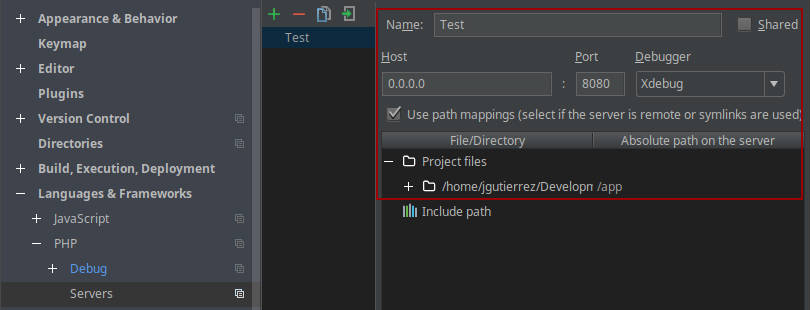

# PHP development Docker image

Yet another PHP Docker image for development (based on Alpine Linux for minimal size)

> Focused on library/package development

Bundled with:

* XDebug enabled and configured for remote debugging
* Global Composer installation
* Additionally installed PHP extensions
  * [Multibyte String](http://php.net/manual/en/book.mbstring.php)
  * [cURL](http://php.net/manual/en/book.curl.php)
  * [OpenSSL](http://php.net/manual/en/book.openssl.php)
  * [Zlib](http://php.net/manual/en/book.zlib.php)
  * [BCMath](http://php.net/manual/en/book.bc.php)
  * [GD](http://php.net/manual/en/book.image.php)
  * [OPcache](http://php.net/manual/en/book.opcache.php)

## Available tags

* `5.6`, `5` _([5.6/5/Dockerfile](https://github.com/juliangut/docker-phpdev/blob/master/php/5.6/Dockerfile))_ - docker pull juliangut/phpdev:5.6
* `7.0` _([7.0/Dockerfile](https://github.com/juliangut/docker-phpdev/blob/master/php/7.0/Dockerfile))_ - docker pull juliangut/phpdev:7.0
* `7.1`, `7`, `latest` _([7.1/7/latest/Dockerfile](https://github.com/juliangut/docker-phpdev/blob/master/php/7.1/Dockerfile))_ - docker pull juliangut/phpdev:7.1
* `5.6-fpm`, `5-fpm` _([5.6-fpm/5-fpm/Dockerfile](https://github.com/juliangut/docker-phpdev/blob/master/php/5.6/Dockerfile))_ - docker pull juliangut/phpdev:5.6-fpm
* `7.0-fpm` _([7.0-fpm/Dockerfile](https://github.com/juliangut/docker-phpdev/blob/master/fpm/7.0/Dockerfile))_ - docker pull juliangut/phpdev:7.0-fpm
* `7.1-fpm`, `7-fpm`, `fpm` _([7.1-fpm/7-fpm/fpm/Dockerfile](https://github.com/juliangut/docker-phpdev/blob/master/fpm/7.1/Dockerfile))_ - docker pull juliangut/phpdev:7.1-fpm

## Environment variables

#### XDEBUG_REMOTE_PORT

Remote server port to connect to, IDE should be listening on this port.

_Defaults to `9000`_

#### XDEBUG_REMOTE_HOST

Remote server (host) IP to connect to.

_Defaults to auto discovered `host's ip`_

#### XDEBUG_IDE_KEY

Fixed remote session identifier. _(Not recommended)_

_Not set by default_

#### XDEBUG_REMOTE_AUTOSTART

Auto start remote debugging. _(Not recommended)_

_Defaults to `0`_

## Volumes

#### /app

The default working directory. You should mount your project root path in this volume.

#### /var/log/php

Logging volume for PHP and PHP-FPM logs and xDebug log, profile and trace files.

## Usage

### Getting the image

```bash
docker pull juliangut/phpdev:latest
docker pull juliangut/phpdev:7.0-fpm
```

### Running a container

```bash
docker run -it -v `pwd`:/app juliangut/phpdev:latest
```

#### Running built-in server in a container

```bash
docker run -d -p 8080:8080 -v `pwd`:/app juliangut/phpdev:latest php -S 0.0.0.0:8080 -t /app/public
```

_Access running server on `http://localhost:8080`_

##### With Docker Compose
 
```yaml
app:
  image: juliangut/phpdev:latest
  ports:
    - "8080:8080"
  volumes:
    - .:/app
  command: "php -S 0.0.0.0:8080 -t /app/public"
```

```bash
docker-compose up
```

#### Running composer command in a container

```bash
docker run -v `pwd`:/app juliangut/phpdev:latest composer [command]
```

#### Accessing a running container

```bash
docker exec -it [container_id] /bin/bash
```

### Using xDebug

It is **not** recommended to have a fixed remote session identifier and an auto-started remote session using "XDEBUG_IDE_KEY" and "XDEBUG_REMOTE_AUTOSTART".

The preferred way of starting a remote debug session is by setting remote session identifier dynamically by one of the following means

* On browser by setting "XDEBUG_SESSION" cookie with the session identifier as its value.
* On HTTP request (cURL) by adding "XDEBUG_SESSION_START" parameter to the URI or as a POST parameter. eg: `curl -X POST -F "XDEBUG_SESSION_START=PHPSTORM" http://example.local`

##### xDebug profiler

To activate the profiler set "XDEBUG_PROFILE" cookie. Profile `cachegrind.out.*` files will be saved into `/var/log/php` directory

##### xDebug trace

To activate the trace set "XDEBUG_TRACE" cookie. Trace files will be saved into `/var/log/php` directory

> There are [browser plugins/extensions](https://xdebug.org/docs/remote#starting) to toggle this cookies easily.

#### Debugging with PHPStorm

##### Review xDebug configuration


* Port must be the same previously defined in `XDEBUG_REMOTE_PORT`

##### Create a server



* Name will be used later, so make it relevant
* Host and port must be the same set in built-in server
* Map your project root to container location (/app)

##### Start listening for xDebug

Click the phone icon to start listening


##### Start the container

Setting `PHP_IDE_CONFIG` environment variable to the server name you defined earlier

```bash
docker run -d -p 8080:8080 -v `pwd`:/app -e PHP_IDE_CONFIG="severName=Test" juliangut/phpdev:latest php -S 0.0.0.0:8080 -t /app/public
```

##### Using Docker Compose

```yaml
app:
  image: juliangut/phpdev:latest
  ports:
    - "8080:8080"
  environemnt:
    - PHP_IDE_CONFIG: "severName=Test"
  volumes:
    - .:/app
  command: "php -S 0.0.0.0:8080 -t /app/public"
```

```bash
docker-compose up
```

## Extending the image

The image comes with just the minimum PHP extensions, you most probably will need more.

```
FROM juliangut/phpdev:latest

RUN docker-php-ext-install \
    pdo_mysql \
  && pecl install \
    mongodb \
    redis \
  && docker-php-ext-enable \
    mongodb \
    redis \

RUN composer global require phpunit/phpunit
```

## License

See file [LICENSE](https://github.com/juliangut/docker-phpdev/blob/master/LICENSE) included with the source code for a copy of the license terms.
